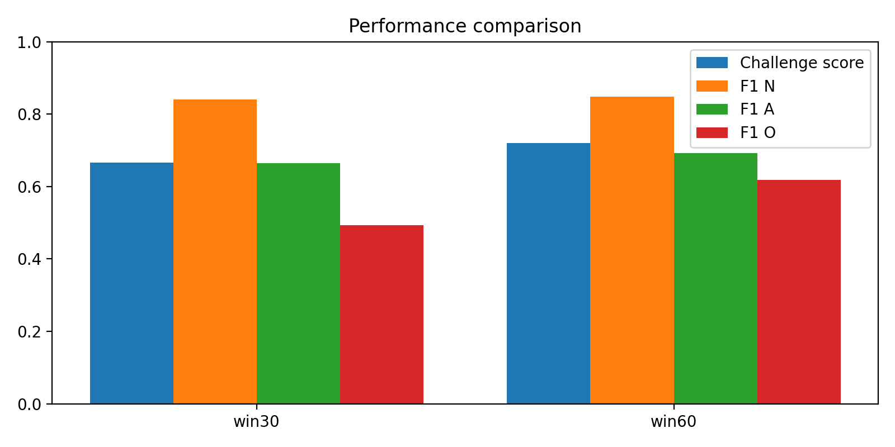
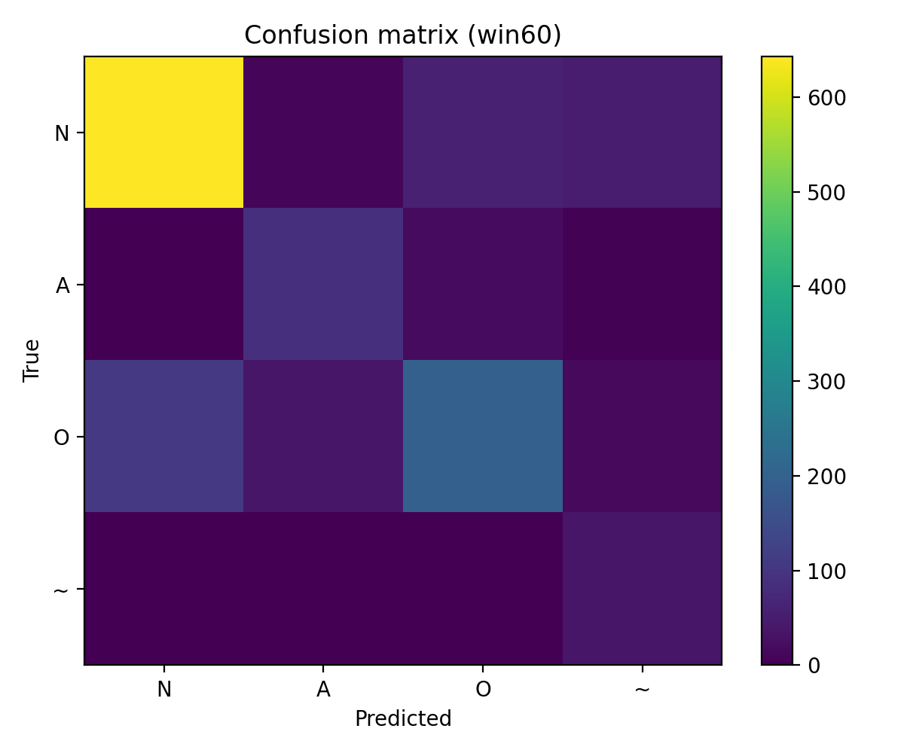

[README.md](https://github.com/user-attachments/files/24175410/README.md)
# ECG Rhythm Classification on PhysioNet/CinC 2017 (Single-Lead)

<p align="center">
  
</p>


This repository contains an end-to-end time-series deep learning project for classifying short single-lead ECG recordings into:
- **N**: Normal sinus rhythm  
- **A**: Atrial fibrillation (AF)  
- **O**: Other rhythm  
- **~**: Too noisy to classify  

The core deliverable is a single Jupyter notebook that performs **data indexing, preprocessing, model training (ResNet1D), evaluation, and figure generation**.

> Disclaimer: This project is for machine learning research/education on a public dataset. It is **not** medical advice and **not** a diagnostic tool.

---

## What is an ECG?

An **electrocardiogram (ECG)** is a recording of the heart’s electrical activity measured on the skin. ECG signals reflect cardiac depolarization and repolarization over time and are commonly used to detect rhythm abnormalities (arrhythmias).

A **single-lead ECG** captures the electrical potential difference from one viewpoint. It is useful for rhythm screening and monitoring, but is less comprehensive than a clinical 12-lead ECG.

---

## Dataset: PhysioNet/CinC Challenge 2017

The PhysioNet/Computing in Cardiology Challenge 2017 focuses on classifying **short single-lead ECG recordings** (roughly tens of seconds) into **N / A / O / ~**.

This repo assumes you have already downloaded and extracted the official training data and have the `REFERENCE.csv` label file.

link to dataset:https://physionet.org/content/challenge-2017/1.0.0/training/#files-panel

---

## Approach

### Preprocessing
- Load ECG waveform from `.mat`
- Per-record normalization: **z-score**
- Standardize variable-length signals by:
  - cropping or padding to a fixed window length

### Models
- **Baseline**: ResNet1D on raw waveform windows

### Training
- Loss: weighted cross-entropy to mitigate class imbalance  
- Optimizer: AdamW  
- Metric: **Challenge score = macro-F1 over (N, A, O)**  
  - Noisy `~` is evaluated but excluded from the averaged score.

---

## Experiments and Results

### Summary (Test Set)

| Run | Window | Challenge Score (Test) | F1(N) | F1(A) | F1(O) |
|---|---:|---:|---:|---:|---:|
| win30 | 30s | 0.6662 | 0.8406 | 0.6644 | 0.4935 |
| win60 | 60s | **0.7202** | 0.8488 | 0.6929 | **0.6188** |

Key takeaway: increasing the window from **30s → 60s** substantially improves the hardest class (**Other**), suggesting longer temporal context helps separate heterogeneous rhythms.

---

## Figures



### Confusion matrices



---

## Reproducibility
-A fixed SEED is used for splits and initialization.

### Environment
- Python 3.10+ recommended
- Packages listed in `requirements.txt`
- GPU optional (CUDA recommended)

Install dependencies:
```bash
pip install -r requirements.txt


## Limitations

- **“Other” is a heterogeneous label.** The `O` class is a catch-all for multiple non-AF, non-normal rhythms. This creates intrinsic label ambiguity and makes the class harder to learn and interpret (higher overlap with both `N` and `A`).

- **Record-level splitting (not patient-level).** The dataset labels provided here do not include patient identifiers, so the train/val/test splits are performed by **record**. If multiple recordings come from the same person, this can inflate performance compared to a true patient-level split.

- **Single-lead ECG only.** Single-lead signals contain less information than 12-lead clinical ECGs, which limits the ability to distinguish morphologically similar rhythms and reduces robustness across devices/lead placements.

- **Fixed-window cropping/padding.** Using a fixed window (30s or 60s) can miss intermittent rhythm evidence outside the selected segment. Padding also introduces artificial silence that may affect learning, especially for short recordings.

- **Limited hyperparameter search.** The experiments focus on a controlled comparison (30s vs 60s windows). Results could improve with systematic tuning (learning rate schedules, regularization, architecture depth/width).

- **No clinical validation.** This is a machine learning project on a public dataset. It has not been clinically validated and must not be used for medical decision-making.

---

## Future Work


- **Noise-first pipeline:** train a small model to detect `~` (noisy) vs not, then classify N/A/O on cleaner signals.

- **Calibration:** calibrate probabilities (e.g., temperature scaling) so confidence better matches correctness.

- **Robustness checks:** test performance under noise, baseline wander, and resampling to mimic real device conditions.

- **Explainability:** add simple saliency/occlusion plots to see which ECG regions drive predictions.

